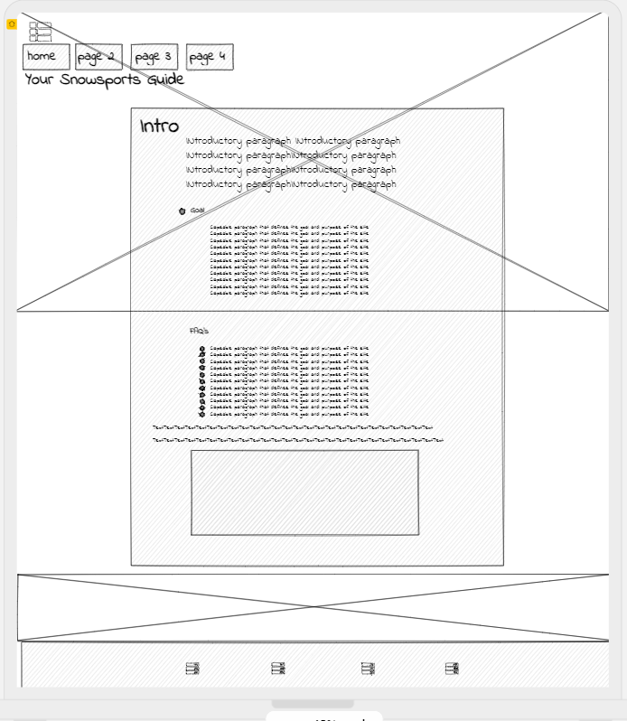
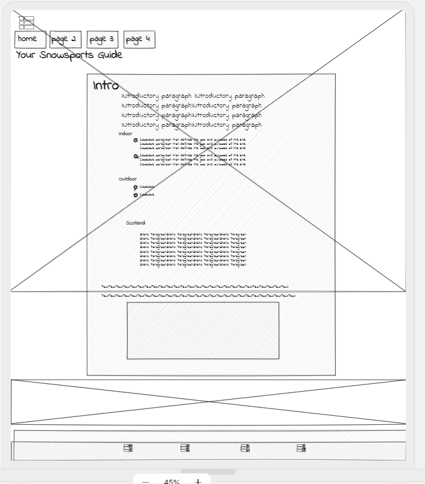
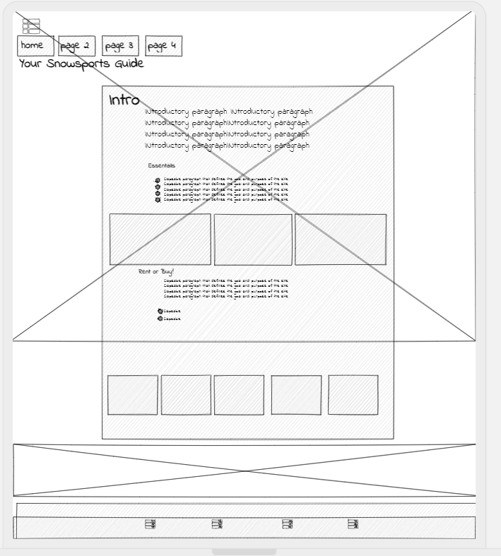
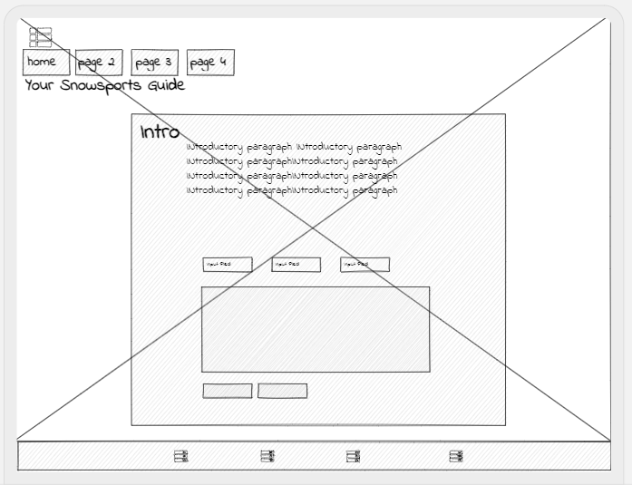
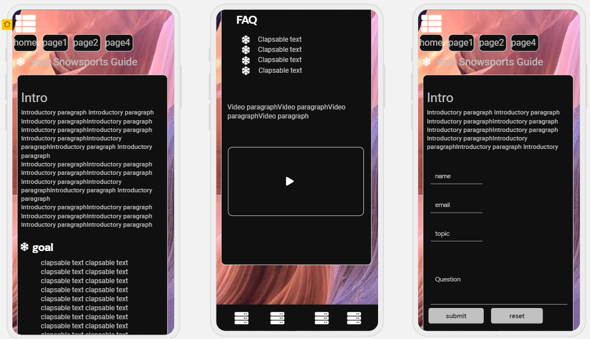
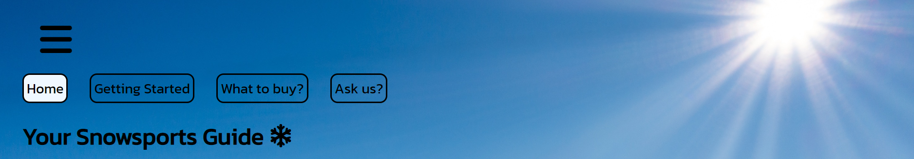

# Your Snowsports Guide
placeholder image 

"Your Snowsports Guide" was designed to provide valuable and useful infomation for people that are looking to get themselves, friends or family into the world of snowsports. specifically Skiing and Snowboading. Ideally any user will come to the end of the website with their questions answered, their doubts disuaded and a good base of knowledge that will help them on their journey into the world of snowsports.

## contents:
1. [User experiance](##User-experiance:)
   - [Mockup desings](###Simple-Initial-design-plans:)
2. [Features](##features:)
   - [Navigation bar](####navigation-bar)
___
## User experiance:
### What I wanted to achieve:

1. Each user should come away from the website having learned something new about the world of snowsports.

2. If the user has a specific question that is not answered they will have the ability to ask their question.

3. The information provided is formatted in a clear and consistant way.

4. The website provokes a positive response through its imagary and formatting

5. The style of the website is consistant throughout all pages.

6. Responsive design allows the site to be easily viewed across multiple devices.
___
### Simple initial design plans:
Page | Mockup example |
--- | --- |
Index |  |
Getting started |  |
What to buy? |  |
Ask us |  |
Mobile example |  |
___
## features: 
### And how these help achieve the above goals:
#### Navigation bar 
   - The simple clapsable navigation Icon provides the user a simple and effective way to navigate to the different pages of the site.
   - The styling is consistant throughout all pages and shows clearly which page the user is currently in as well as the repsonisve colour change that clearly highlights user interaction.
   - The main header/logo of the page is also a clickable link as is common place in many websites across the web.

2. striking back ground image
3. clear container of information
  * Opening paragraph in each page
  *  Clapsable blocks of information
4. video/map 
5. social links
6. links to external sites that have relevence
7. ask us form

## tech used, what why how it helped
* languages
1. HTML5
2. CSS3
* external tech utilised
1. GitHub
2. GitPod
3. font awesome
4. google fonts
5. Uizard
6. Chrome devtools
7. W3C HTML validator
8. Jigsaw CSS validator

## testing
1. W3C validation
2. Jigsaw validation
3. Lighthouse

Manual Testing:
* name different devices we tested, wht worked what didnt, if things didnt how we plan to fix them.
* simple questionare for 10 people or so to provide feedback.

## finished product
screen shots how it works, areas of improvment. known bugs. possible fixes

## deployment
1. explain how we deployed the site to GitHub pages

## credits/acknowledgments
Content:
1. All code was written by myself no external code was utilised in this webpage. However stackoverflow was used regulary in order to gain a better understanding of how how certain elements interact and best practices for implementation.

2. Youtube video
3. google map
4. google fonts
5. font awsome

Media:
1. refrence where each image came from
