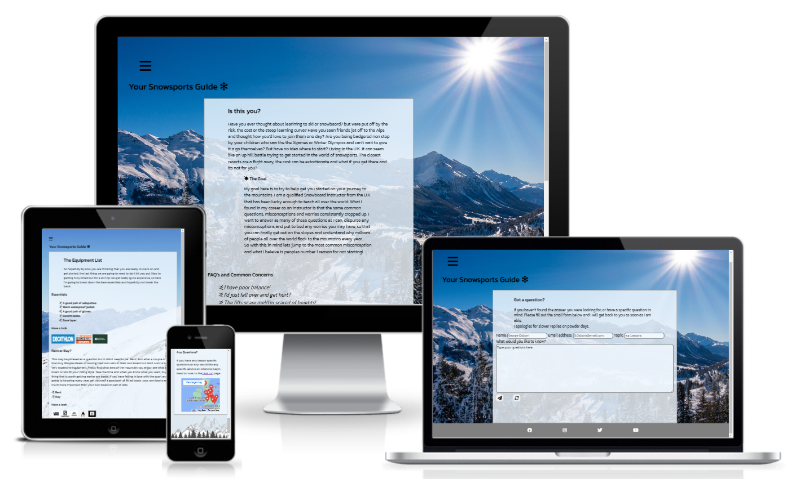
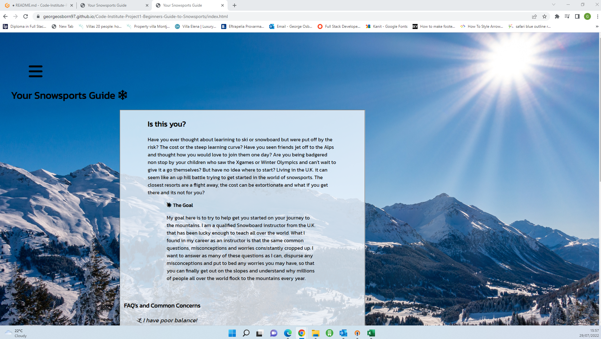
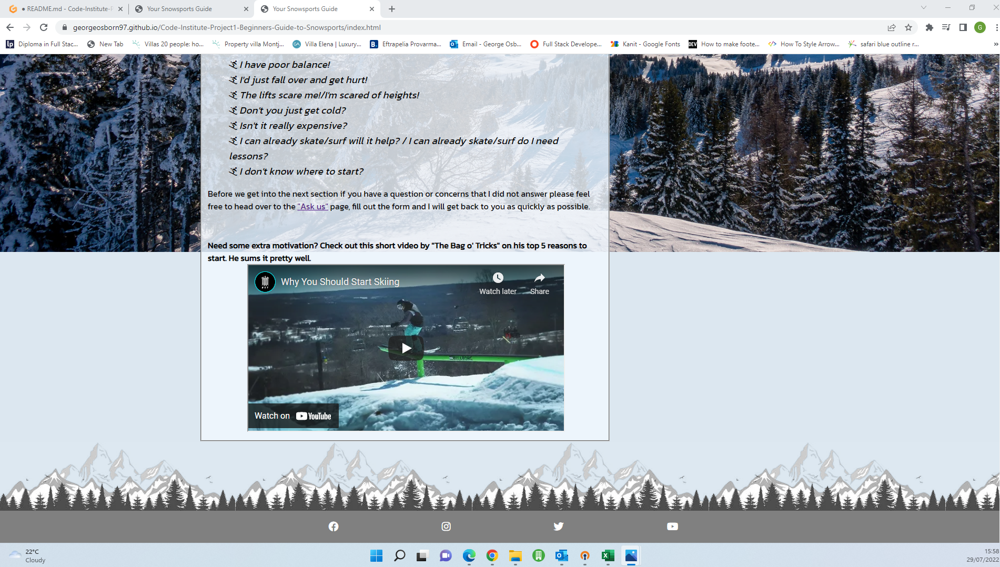
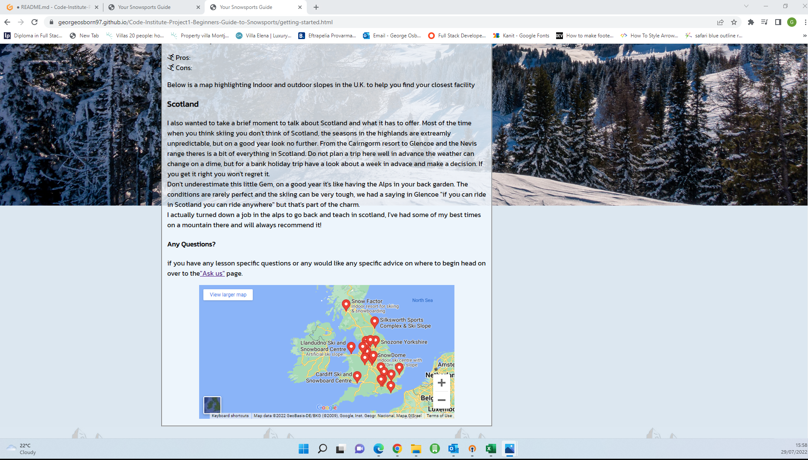
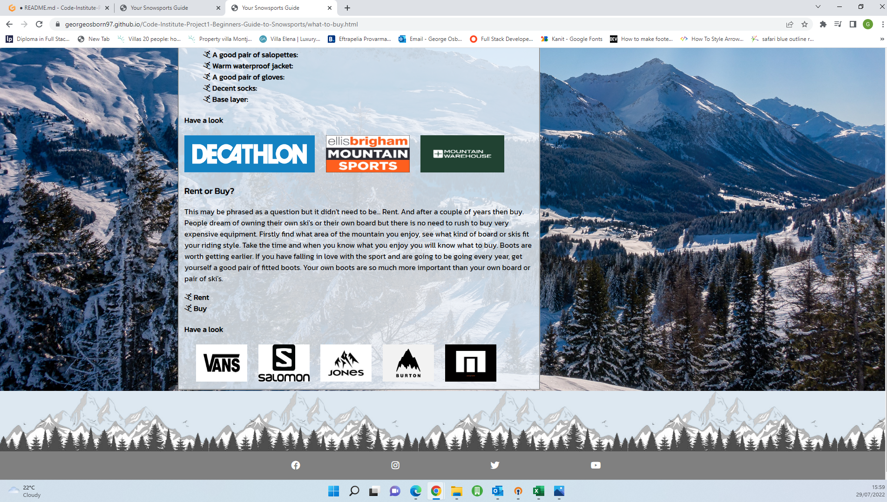
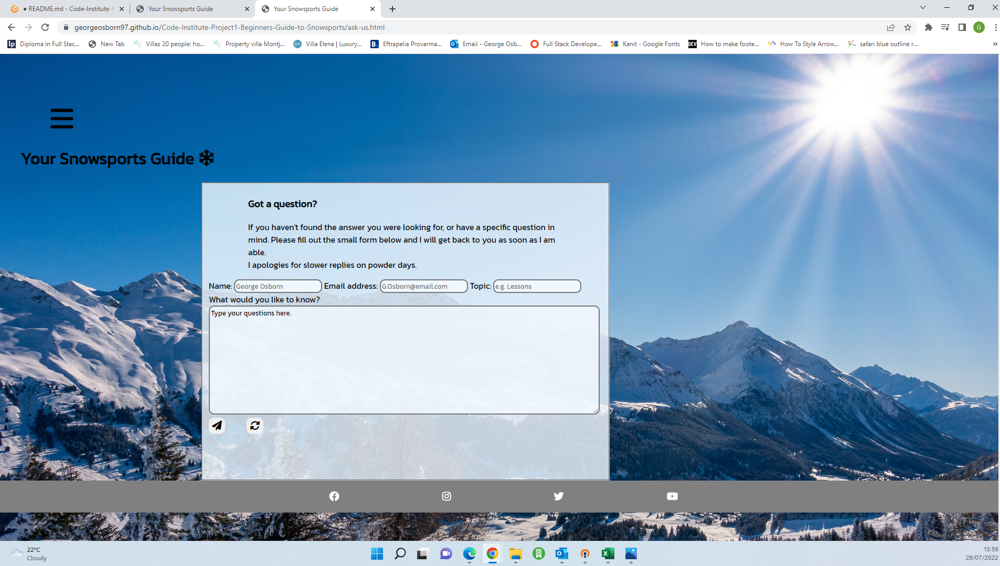
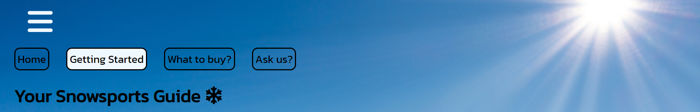

# Your Snowsports Guide

"Your Snowsports Guide" was designed to provide valuable and useful infomation for people that are looking to get themselves, friends or family into the world of snowsports. specifically Skiing and Snowboading. Ideally any user will come to the end of the website with their questions answered, their doubts disuaded and a good base of knowledge that will help them on their journey into the world of snowsports.

Find a link to the deployed site [here](https://georgeosborn97.github.io/Code-Institute-Project1-Beginners-Guide-to-Snowsports/)

## contents:
1. [User experiance](#user-experiance)
   - [Mockup desings](#simple-initial-design-plans)
2. [Final product](#final-product)
   - [Page 1 top](#page-1-top---home)
   - [Page 1 bottom](#page-1-bottom---home)
   - [Page 2 top](#page-2-top---getting-started)
   - [Page 2 bottom](#page-2-bottom---getting-started)
   - [Page 3 top](#page-3-top---what-to-buy)
   - [Page 3 bottom](#page-3-bottom---what-to-buy)
   - [Page 4](#page-4---ask-us)   
3. [Features](#features)
   - [The background image and the general formatting](#the-background-image-and-the-general-formatting)
   - [Navigation bar](#navigation-bar)
   - [Information formatting](#neatly-formatted-information)
   - [Video/map](#videomap)
   - [Social links](#social-links)
   - [Brand links](#brand-links)
   - [User form](#ask-us-form)
4. [Technology that was utilised](#technology-that-was-utilised)   
   - [Languages](#languages)
   - [External assets](#external-assets-utilised)
5. [Testing](#testing)  
   - [HTML W3C Validation](#html-w3c-validation)
   - [CSS Jigsaw validation](#jigsaw-validation)
   - [Lighthouse](#lighthouse)
   - [Desktop results](#desktop-results)
   - [Mobile results](#mobile-results)
   - [Manual testing](#manual-testing)
   - [Device testing](#device-testing)
   - [user feedback](#user-feedback)
6. [Deployment](#deployment)
7. [Credits/Acknowledgments](#creditsacknowledgments)
   - [Content](#content)
   - [Media](#media)  
8. [Final thoughts](#final-thoughts)    
___
## User experiance:
### What I wanted to achieve:

1. Each user should come away from the website having learned something new about the world of snowsports.

2. If the user has a specific question that is not answered they will have the ability to ask their question.

3. The information provided is formatted in a clear and consistant way.

4. The website provokes a positive response through its imagary and formatting

5. The style of the website is consistant throughout all pages.

6. Responsive design allows the site to be easily viewed across multiple devices.
___
### Simple initial design plans:
Page | Mockup example |
--- | --- |
Index |  |
Getting started |  |
What to buy? |  |
Ask us |  |
Mobile example |  |
___
## Final Product
### Page 1 top - Home

### Page 1 bottom - Home

### Page 2 top - Getting started

### Page 2 bottom - Getting started

### Page 3 top - what to buy?

### Page 3 bottom - What to buy?

### Page 4 - Ask us?

___
## Features: 
### The background image and the general formatting:
   - the background image aims to provides a feeling of warmth and joy due to the striking bright sun that captures the users initial attention.
   - the image aims to stand out and without distracting from the purpose of the site, its content. The fieldset provides enough difference to draw you to it without conflicting with the image.
   - the navigation elements at the top of the page are clear yet do not distract from the main text
   
### Navigation bar: 
   - The simple clapsable navigation Icon provides the user a simple and effective way to navigate to the different pages of the site.
   - The styling is consistant throughout all pages and shows clearly which page the user is currently in as well as the repsonisve colour change that clearly highlights user interaction.
   - The main header/logo of the page is also a clickable link as is common place in many websites across the web.

### Neatly formatted information:
   - To avoid large portions of text that may confuse the user, all key information is contained within clapsable elements.
   - the clapsable elements clearly register interaction with a clear colour change and slight size shift. Enough to be visible but not distracting.
   - With the large blocks of text hidden the user will be able to more easily find the specific information they seek.
  
 
### Video/map: 
   - The video in the index is completely user controlled they can choose to view it or not.
   - The aim of the video is to provide an additional more visual hook to the website that carries on the themes and goals of this site.
   - The map like the video provides are visual hook, however the purpose of this map is to give additional information regarding a specific topic in page 2.
  
 
### Social links:
   - The social links at the bottom of every page simply allow the user to follow me on various social media platforms to see a more personal take on snowpsorts.
   
### Brand links:
   - The brands links allow the user to go on to the various brands specific websites in a blank tab, in order to see for themselves what kind of equipment is out there and with the aid of this site make an informed decision on what they need.
   
### Ask us form:
   - The user form on the final page provides the user the ability to ask a more specfic question about any topic in the world of snowsports.
   - All areas must be filled in in order to post the form.
   
___
## Technology that was utilised:
### languages:
* HTML5
* CSS3
### external assets utilised:
* [GitHub](https://github.com/)
* [GitPod](https://gitpod.io/)
* [font awesome](https://fontawesome.com/)
* [google fonts](https://fonts.google.com/)
* [Uizard](https://uizard.io/)
* [amiresponsive](https://ui.dev/amiresponsive)
* Chrome devtools
* Google images
* [W3C HTML validator](https://validator.w3.org/)
* [Jigsaw CSS validator](https://jigsaw.w3.org/css-validator/)
___
## testing:
In order to test responisve elements throughout the development process Chrome Devtools was used frequently.
### HTML W3C validation:
   - On the first test, the width was set incorrectly for both iframes in the index and page 2. this was fixed by removing the width="" atribute and using the style="" attribute for the width.
   - Also on the first test there was a highighted error in the iframes where i put a p element between the opening and closing tag. This had to be removed.
   - in the validation for the "Ask us" page a label error was highlighted, this was fixed by adding aria-labels to the submit and reset buttons.
   - on testing all pages there was a warning for sections with no headings, these were changed to divs to solve this.
   - On final validation no errors were highlighted in any of the HTML code.
### Jigsaw validation:
   - No errors were highlighted during CSS validation at any stage.
### Lighthouse:
#### Desktop results:
   - Index results

   - Getting started results

   - What to Buy? results

   - Ask us? results

#### Mobile results:
   - Index results

   - Getting started results

   - What to Buy? results

   - Ask us? results

### Manual Testing:
#### Feature Testing:
* Background images: 
   - To make sure the CSS providing the images worked correctly the previewed site cache was constantly refreshed. 
   - In order to ensure that all the background images correctly showed on all devices Chrome dev tools was used to simulate different devices.
* Font awesome icons:
   - The icons I have selected to show from Font awesome all are cleaerly present when the site is loaded.
   - The icons linked to the clapsable text held within the fieldset change from a person skiing to a burst when open. All clapsable text was opened and closed to ensure this was present across all clapsable text.
   - Safari/IOS does not show these changing font awesome icons. I believe this is a issue with IOS as this feature has been tested on mutiple other devices and works as designed.
* Hover effects:
   - When the curser is moved over the nav icon and the claspable text they turn white and blue respectively. 
   - When the navigation items in the nav menu are hovered over they appear underlined.
   - When the clapsable text, brand icons, social links and submit/refresh buttons are hovered over they increase by a scale of 1.01, 1.05, 1.2 and 1.5 respectively.
* clapsable text:
   - The clapsable text stays open after one click and will claspe again after a second click.   
* Video:
  - The video does not autoplay when the page is loaded.
  - when the video is clicked the video plays, it can be paused, started again and can enter and exit full screen.
* Map:
  - The map can be zoomed in and out, the highlighted pins can be selected on PC, and a the map can be enlarged to take the user to Googlemaps. 
  - On mobile when the map is selected Google maps is opened instantly.
* Ask us:
  - If no information any information is not entererd the form will not submit.    
* Internal and External links:
  - All external links open in a new tab.
  - All Internal links take the user to the correct page.
#### Device testing:
This site has been physically tested on:
   - ASUS ZenBook
   - Iphone X
   - Samsung Galaxy S20
After the initial deployment these are the bugs that need addressing:
   1. Brand logos not showing on either desktop or mobile.
      - This bug was due to an error in the pathway to the images, with that clear the images loaded fine
   2. Icons for clapsable text are the default arrows on mobile
      - This issue appears to only be a problem for IOS, the icons load fine on Android. Issue still needs addressing on IOS
   3. On mobile the nav bar icon is now present when it should not be.
      - This issue is also only on IOS and still requires a fix.
   4. on mobile when the nav bar is selected a blue border is visible.
      - This is also an IOS issue that requires a fix. 
      - This was fixed by applying an "outline:none !important" to the all summary elements.
   5. when the page is loaded on mobile the screen width is ok, however if you attempt to zoom out or scroll to the right, the image stops abrubtly and a margin with the background colour is visible on the right.
      - This issue was due to the width of the h1 element, the width was set to 90vw and this appears to of solved this problem.
   ___
## deployment:
All code was written in Gitpod, pushed to GitHub and deployed to GitHub Pages.

In order to deploy our site from GitHub to Github pages the stages are as follows:

   1. From the repostories page in GitHub select the project that needs to be deployed.
   2. go to settings then on the right hand side menu select pages.
   3. within this page go to the souce dropdown and select "main" then select save.
   4. from here the link appears to our deployed site.   
___
## credits/acknowledgments
### Content:
- All code was written by myself no external code was copied in this webpage. However stackoverflow was used regulary in order to gain a better understanding of how certain elements interact and best practices for implementation. As well as Dilshan Kelsen who helped me to style the arrow in a summary element his site and the specific page can be found [here](https://dilshankelsen.com/style-arrow-of-html-accordion/)
- All icons are from [Font awesome](https://fontawesome.com/icons)
- the font used was imported from Google fonts and created by Cadson Demak @ Principal design it can be viewed [here](https://fonts.google.com/specimen/Kanit?preview.text=Your%20Snowsports%20Guide&preview.text_type=custom#standard-styles)

### Media:
- All images used in this site were taken from Google Images.
- All credit for the Video in the home page goes to "The Bag o' Tricks" link to his page can be found [here](https://www.youtube.com/channel/UCaEXnwWYRc5ph2QqQQviWlA)
- Google maps was used for the Map on "getting Started"
- The Mock up and wireframes were created using both [amiresponsive](https://ui.dev/amiresponsive) and [Uizard](https://uizard.io/) respectivly.
___
## Final thoughts.
Thank you so much for taking the time to look through this project. As my first solo step into the world of software development I have to say I am quite proud of it. 
I'd like to say a huge thank you to Marcel my mentor from Code institute who has been invaluable. As well as the whole Code institute team that has set up a fantastic learning enviroment.

I look forward to returning to this project in the future when my skills as a developer will allow me to take this project to the next level.

